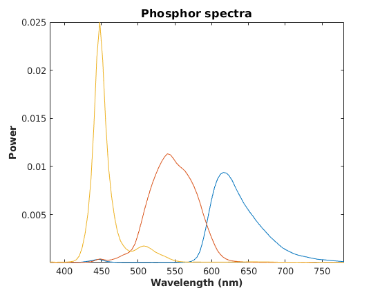
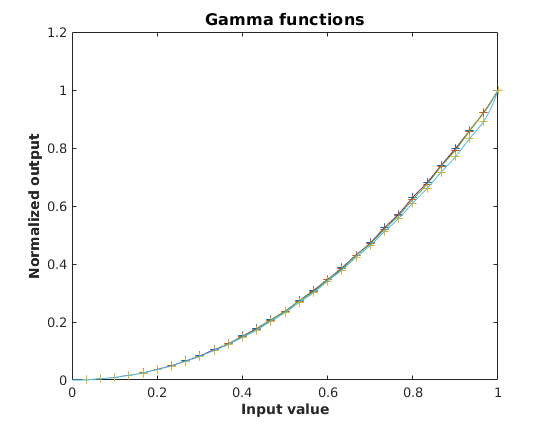
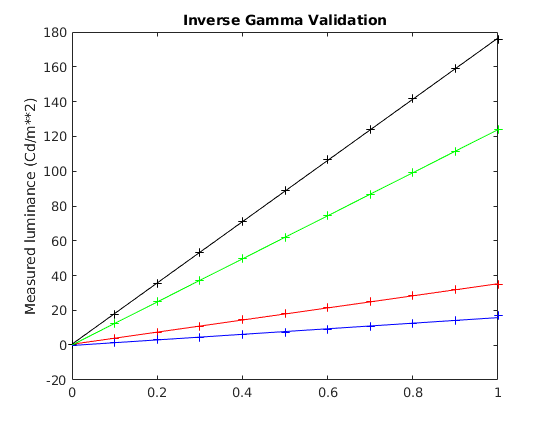

# Linearizing PTB Screens

When linearizing a screen that will use PTB functions for display (i.e. 
**Screen**) instead of the VSG/Visage, we use the PsychToolbox calibration 
methods with changes to use our PR650 and associated functions. 

The PR650 toolbox shipped with PTB does not work with our spectrometer. I replaced
the entire suite of PR650 functions found in PTB folder *PsychHardware/PR650Toolbox*
with the functions named **old650***. Each function takes the same parameters and 
returns the same values. 

For the calibration process, the device-specific functions (i.e. those which rely on 
specific hardware functions for the PR650) are isolated in 6 functions: **CMCheckInit**,
**CMClose**, **PR650measspd**, **CalibrateMonSpd**, **CalibrateMonDrvr**, and **CalibrateAmbDrvr**. The folder containing these
functions (ptbcal folder in this repo) should be in your Matlab path BEFORE the PTB folders,
in order for the calibration to run correctly. 

## Calibration Process for screens using PTB

This process is nearly identical to that originally developed for PTB. I have made small 
modifications but the majority of the process is as originally found in PTB. The replacement
functions above must be in your MATLAB path so that the replacements are picked up instead of 
the PTB functions that they replace. 

The spectrometer should be set up prior to starting. Verify that MATLAB can connect to the 
spectrometer by calling **old650init(port)** with the serial port name as an argument. (On the 
eeg rig, this is *'/dev/ttyUSB0'*. Close the 650 as well with **old650close()**. When you 
call the calibration startup function the spectrometer must NOT be connected. 

The process is started by calling **CalibrateMonSpd**:

```
>> CalibrateMonSpd

This is a modified version of the PTB calibration script CalibrateMonSpd.
It is hard-coded to use a PR-650 spectrometer.

Which screen to calibrate [1]: **1**
Using standard graphics card with 8 bpc framebuffer.
Do you want to blank another screen? (1 for yes, 0 for no) [0]: **0**
Enter RGB values for background (range 0-1) as a row vector [0.745 0.745 0.745]: 
Enter distance from meter to screen (in meters): [0.8]: **.92**
Enter monitor name: **ASUS-VG278Q**
Enter your name: **Dan**
Describe the calibration: **Best**
Enter serial port string for PR650: **/dev/ttyUSB0**
Enter root folder for cal data: **/data/cal**
Enter calibration filename [monitor]: **eeg-asus-2**
Use spectrometer syncMode? (1 for yes, 0 for no) [0]: **0**
PR650 on /dev/ttyUSB0 is ready.
Focus radiometer on the displayed box.
Once meter is set up, hit any key - you will get 10 seconds
to leave room.

```

The queries and their meanings:

<dl>
  <dt><strong>Which screen to calibrate?</strong></dt>
  <dd>We're only using full screen here. Best if its a second screen, but this might work if you have only one screen. Haven't tried it yet!</dd>
  <dt><strong>Serial port string</strong></dt>
  <dd>This string will look like '/dev/ttyUSB0' or '/dev/whatever' on linux, and 'COMn' on windows, where n is an int 1,2,3,....</dd>
  <dt><strong>Root folder for cal data</strong></dt>
  <dd>You must have write permission here! Mat file with calibration data stored here.</dd>
  <dt><strong>calibration filename</strong></dt>
  <dd>Just base filename, don't include '.mat' extension.</dd>
  <dt><strong>sync mode</strong></dt>
  <dd>Will spectrometer try to sync to monitor's refresh? For CRT, enter 1 (yes). For flat screen LCD/LED, enter 0 (no).</dd>
</dl>

Two plots are displayed when the process is complete. The gamma plot *should* have a curve to it. This is the output on a screen with NO gamma correction.






## Validation

This process will open a full screen window linearized by the above process, present a series of full-screen color patches, and measure the luminance of each. The resulting luminances (one each for the red, blue, and green guns, and one for rgb combined) are plotted and a straight-line fit is superimposed on the values. 

```
>> [lumR,lumG,lumB,lumW] = validatePTBGamma(1, '/data/cal/eeg-asus-2.mat');

-------CUTCUTCUTCUT----------------

Background color is [0.500000]
Use floating point range 0.0-1.0 for colors in this window.

Loading cal "eeg-asus-2" from folder /data/cal
Inverse gamma loaded and in use for this window.
Pausing for 5 sec...

Got qual code of 0.
1/44 color (0.000000,0.100000,0.000000), qual 0 lum 12.405315
Got qual code of 0.
2/44 color (0.000000,0.400000,0.000000), qual 0 lum 49.567064
Got qual code of 0.
3/44 color (0.600000,0.600000,0.600000), qual 0 lum 106.764642
Got qual code of 0.

-------CUTCUTCUTCUT----------------

42/44 color (0.400000,0.400000,0.400000), qual 0 lum 71.300391
Got qual code of 0.
43/44 color (0.000000,0.000000,0.300000), qual 0 lum 4.545154
Got qual code of 18.
44/44 color (0.000000,0.000000,0.000000), qual 18 lum 0.388196
>> 
```

A plot of the luminances measured on the screen when using the inverse gamma table is shown. We expect these lines to be straight, or very nearly so. 
The points shown are the actual measurements, and the line is the result of a simple linear fit (polyfit).


